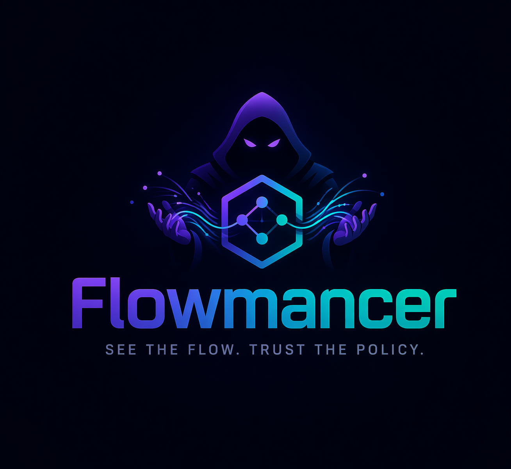

# Flowmancer

<p align="center">
  
</p>

## 프로젝트 소개

Flowmancer는 Kubernetes 환경에서 eBPF를 활용하여 **네트워크 흐름을 관측하고**,  
워크로드의 정상적인 통신 패턴을 학습하여 **이상 트래픽을 탐지하고**,  
이를 기반으로 **NetworkPolicy 초안을 자동 생성하는 프로젝트**입니다.

### 핵심 아이디어

클라우드 환경에서 네트워크 보안은 여전히 어렵습니다.

- 어떤 Pod가 어디로 통신해야 정상인지 알기 어렵고
- NetworkPolicy는 수동으로 작성하기 번거롭고
- 잘못 적용하면 서비스 장애로 이어질 수 있습니다

Flowmancer는 이를 해결하기 위해 다음과 같은 접근을 사용합니다:

1. **eBPF 기반 네트워크 Telemetry 수집**
   - TCP/UDP outbound flow를 커널 레벨에서 수집
   - Pod / Namespace / Workload 단위로 식별

2. **Baseline 생성 (정상 통신 패턴 학습)**
   - 일정 기간 동안 워크로드의 outbound 트래픽을 분석
   - 반복적으로 발생하는 정상적인 연결을 자동 식별

3. **Anomaly 탐지**
   - 기존 baseline에 없던 새로운 destination
   - 비정상적인 포트 / 외부 연결 / 급격한 트래픽 증가
   - 의심스러운 네트워크 행위 감지

4. **NetworkPolicy 초안 생성**
   - baseline을 기반으로 안전한 egress 정책 생성
   - Kubernetes NetworkPolicy 또는 확장 정책으로 변환 가능

---

## 주요 기능 (MVP 목표)

- eBPF 기반 outbound network flow 수집
- Kubernetes workload 단위 flow aggregation
- 자동 baseline 생성
- 신규/이상 네트워크 연결 탐지
- egress NetworkPolicy YAML 생성

---

## 아키텍처 개요

```
eBPF (kernel)
   ↓
Flow Collector (DaemonSet)
   ↓
Flow Aggregation / Storage
   ↓
Baseline Engine
   ↓
Anomaly Detection
   ↓
Policy Generator
```

---

## 기술 스택

- Go
- eBPF (libbpf / cilium/ebpf)
- Kubernetes
- (Planned) ClickHouse for telemetry storage

---

## 개발 환경

### Lima VM 설치 (macOS)

```sh
cd development_environment
limactl start ubuntu-ebpf.yaml
limactl shell ubuntu-ebpf
sudo -s
```

---

### k3s 설치

```sh
./install-k3s.sh
./install-k8s-tools.sh

mkdir -p ~/.kube
sudo cp /etc/rancher/k3s/k3s.yaml ~/.kube/config
sudo chown $(id -u):$(id -g) ~/.kube/config
export KUBECONFIG=~/.kube/config
```

---

## eBPF 개발 환경

### bpftool 설치

```sh
git clone --recurse-submodules https://github.com/libbpf/bpftool.git
cd bpftool/src 
make install 
```

---

### bpf2go 설치

```sh
go install github.com/cilium/ebpf/cmd/bpf2go@latest
echo 'export PATH="$HOME/go/bin:$PATH"' >> /root/.bashrc
```

---

### vmlinux.h 생성

```sh
bpftool btf dump file /sys/kernel/btf/vmlinux format c > vmlinux.h
```

---

## 프로젝트 상태

🚧 Early MVP (in progress)

---

## 비전

Flowmancer는 단순한 네트워크 모니터링 도구가 아니라,

> **"네트워크 흐름을 이해하고, 스스로 정책을 제안하는 시스템"**

을 목표로 합니다.
